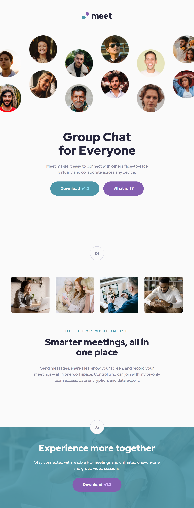

# Frontend Mentor - Meet landing page solution

This is a solution to the [Meet landing page challenge on Frontend Mentor](https://www.frontendmentor.io/challenges/meet-landing-page-rbTDS6OUR). Frontend Mentor challenges help you improve your coding skills by building realistic projects. 

## Table of contents

- [Overview](#overview)
  - [The challenge](#the-challenge)
  - [Screenshot](#screenshots)
  - [Links](#links)
- [My process](#my-process)
  - [Built with](#built-with)
  - [What I learned](#what-i-learned)
  - [Useful resources](#useful-resources)

## Overview

### The challenge

Users should be able to:

- View the optimal layout depending on their device's screen size
- See hover states for interactive elements

### Screenshots

Desktop:

Tablet:

Mobile:

### Links

- Live site: <https://michahuhn.github.io/frontendmentor-meet-landing-page>
- Challenge solution: <https://www.frontendmentor.io/solutions/meet-landing-page-using-vue-PEep7g3r7Y>

## My process

### Built with

- Vue
- SCSS
- CSS custom properties
- CSS Grid
- Flexbox
- Semantic HTML5 markup
- Mobile-first workflow
- Accessibility

### What I learned

* I learned how to create responsive Grid layouts. The page not only adapts fluidly on different screen sizes,
but each view (mobile, tablet, and desktop) has also a different layout.
* I used SCSS mixins to create typography presets which can be easily applied to the desired elements.
They can also be swapped in different media queries which is not possible with SCSS placeholders.
* In addition, I implemented a "Skip to main content" button to enhance accessibility.

### Useful resources

- [Get your stylesheets more organized with Sass partials - YouTube](https://www.youtube.com/watch?v=9Ld-aOKsEDk) - My SCSS folder structure is inspired by this video.

How to implement a "Skip to main content" button to enhance accessibility:

- [Most sites have a skip-to-main link, and yours should too! - YouTube](https://www.youtube.com/watch?v=jDDaOFr9nqQ)
- [Why Does Nearly Every Site Have This “Invisible Unclickable“ Link? - YouTube](https://www.youtube.com/watch?v=VUR0I5mqq7I)
